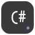
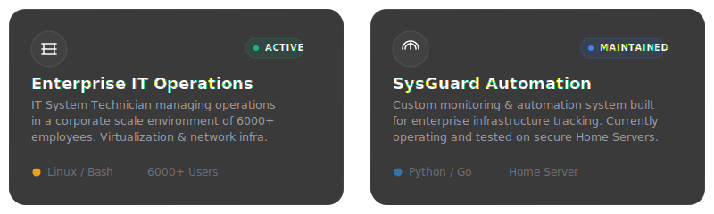
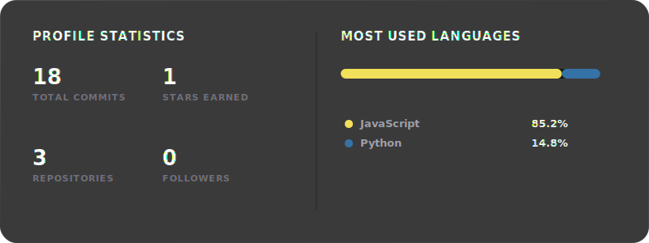
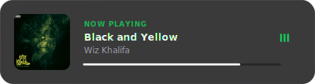

<!-- Premium GitHub Profile README by Alonezdb (Nico) -->

  <!-- Hero Section -->
  
  
   
  
  <!-- Typing Animation -->
  
  
   
  
  <!-- Divider -->
  

 

<!-- About & Terminal Grid Section -->
<table width="800" border="0" cellpadding="0" cellspacing="0" align="center" style="border-collapse: collapse; border: none; margin: 0 auto;">
  <tr style="border: none;">
    <td width="380" valign="top" style="border: none; padding: 10px;">
      <h3 style="font-family: -apple-system, BlinkMacSystemFont, 'Outfit', 'Segoe UI', sans-serif; font-weight: 700; color: #ffffff; letter-spacing: -0.02em; margin-top: 0;">WHO IS NICO?</h3>
      

        I am an <strong>IT System Technician</strong> specialized in constructing resilient infrastructure, virtualization architectures, and secure enterprise networks.
      

      

        Bridging the gap between physical networks and software automation, I build workflows that are highly performant, scalable, and secure.
      

      <h4 style="font-family: -apple-system, BlinkMacSystemFont, 'Outfit', 'Segoe UI', sans-serif; font-weight: 600; color: #e4e4e7; font-size: 12px; letter-spacing: 0.1em; margin-bottom: 8px;">CURRENT FOCUS</h4>
      <ul style="font-family: -apple-system, BlinkMacSystemFont, 'Outfit', 'Segoe UI', sans-serif; font-size: 13.5px; color: #71717a; line-height: 1.7; padding-left: 20px; margin: 0;">
        <li>Automating VM environments and setups using Python &amp; Bash.</li>
        <li>Enterprise firewall configurations and VLAN network segmentation.</li>
        <li>Container orchestration &amp; secure GitOps pipelines.</li>
      </ul>
    </td>
    <td width="40" style="border: none;"></td>
    <td width="380" valign="top" style="border: none; padding: 10px;">
      
    </td>
  </tr>
</table>

 

  <!-- Divider -->
  

 

<!-- Architecture / Automation / DevOps Cards (Mockups Showcase) -->

  <h3 style="font-family: -apple-system, BlinkMacSystemFont, 'Outfit', 'Segoe UI', sans-serif; font-weight: 700; color: #ffffff; letter-spacing: -0.02em; margin-bottom: 10px;">CORE VALUES</h3>
  

 

  <!-- Divider -->
  

 

<!-- Tech Stack Section -->

  <h3 style="font-family: -apple-system, BlinkMacSystemFont, 'Outfit', 'Segoe UI', sans-serif; font-weight: 700; color: #ffffff; letter-spacing: -0.02em; margin-bottom: 25px;">ENGINEERING STACK</h3>
  
  <!-- Hoverable stack of custom handcrafted icons -->
  
  
  
  
  
  
  
  
  
  
  
  

  

  <!-- Divider -->
  

 

<!-- Projects Showcase -->

  <h3 style="font-family: -apple-system, BlinkMacSystemFont, 'Outfit', 'Segoe UI', sans-serif; font-weight: 700; color: #ffffff; letter-spacing: -0.02em; margin-bottom: 20px;">FEATURED PROJECTS</h3>
  

 

  <!-- Divider -->
  

 

<!-- Statistics & Languages -->

  <h3 style="font-family: -apple-system, BlinkMacSystemFont, 'Outfit', 'Segoe UI', sans-serif; font-weight: 700; color: #ffffff; letter-spacing: -0.02em; margin-bottom: 20px;">ANALYTICS &amp; METRICS</h3>
  

 

  <!-- Divider -->
  

 

<!-- Live Spotify & Snake Grid -->
<table width="800" border="0" cellpadding="0" cellspacing="0" align="center" style="border-collapse: collapse; border: none; margin: 0 auto;">
  <tr style="border: none;">
    <!-- Spotify Live Card -->
    <td width="420" valign="top" style="border: none; padding: 10px;">
      <h4 align="center" style="font-family: -apple-system, BlinkMacSystemFont, 'Outfit', sans-serif; font-weight: 700; color: #e4e4e7; font-size: 13px; letter-spacing: 0.05em; margin-top: 0; margin-bottom: 15px;">SPOTIFY LIVE STATUS</h4>
      

        
      

    </td>
    <td width="20" style="border: none;"></td>
    <!-- Contribution Snake -->
    <td width="360" valign="top" style="border: none; padding: 10px;">
      <h4 align="center" style="font-family: -apple-system, BlinkMacSystemFont, 'Outfit', sans-serif; font-weight: 700; color: #e4e4e7; font-size: 13px; letter-spacing: 0.05em; margin-top: 0; margin-bottom: 15px;">CONTRIBUTION GRAPH</h4>
      

        
      

    </td>
  </tr>
</table>

 

<!-- Let's add Discord and Git contacts in a beautiful centered layout -->

   
  <table border="0" cellpadding="0" cellspacing="0" style="border-collapse: collapse; border: none;">
    <tr style="border: none;">
      <!-- Discord Card -->
      <td style="border: none; padding: 0 10px;">
        <a href="https://discord.com" target="_blank" style="text-decoration: none;">
          

            Discord: <strong>zdb.</strong>
          

        </a>
      </td>
      <!-- GitHub Card -->
      <td style="border: none; padding: 0 10px;">
        <a href="https://github.com/Alonezdb" target="_blank" style="text-decoration: none;">
          

            GitHub: <strong>Alonezdb</strong>
          

        </a>
      </td>
    </tr>
  </table>

 

  <!-- Divider -->
  
  
   
  
  <!-- Footer Signature -->
  

